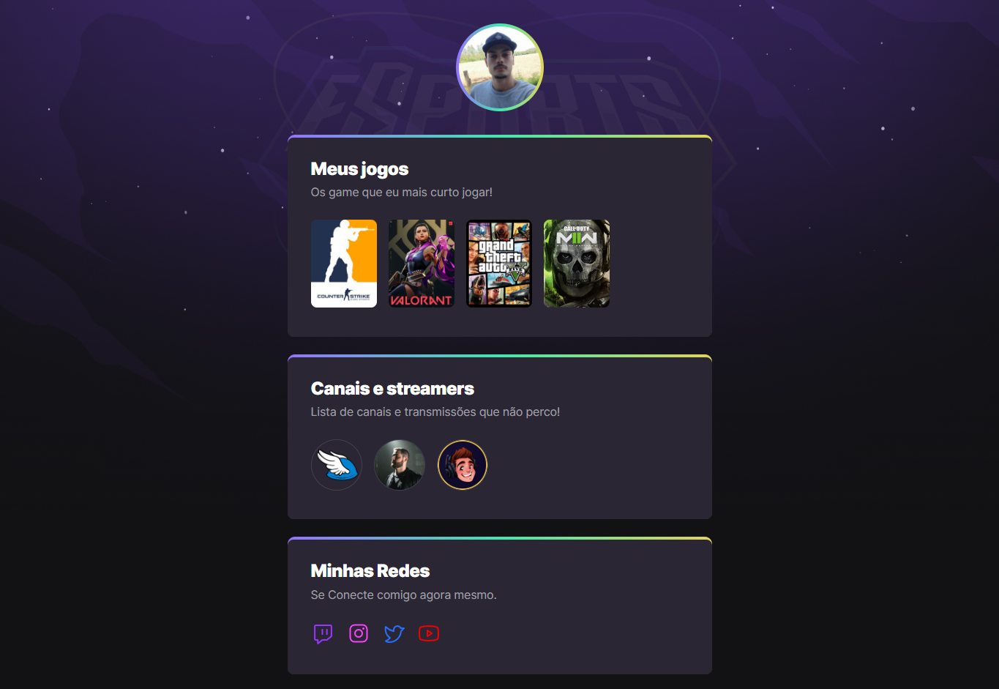

# NLW eSports - Trilha Explorer

Projeto construído no evento Next Level Week da Rocketseat

🔗[Clique aqui para acessar](http://joao-lschroer.github.io/nlw-esports-explorer)

## 🛠 Tecnologias

- HTML
- CSS
- Git e Github

## 📚 O que Aprendi :
- Boas práticas de programação
- Estrutura e semântica html
- Animações em css : destaque para border-radius, background-image: linear-gradient, display flex, flex-wrap e @keyframes.

## 📞 Contato

- 51 997682378

- joao.lschroer@gmail.com
